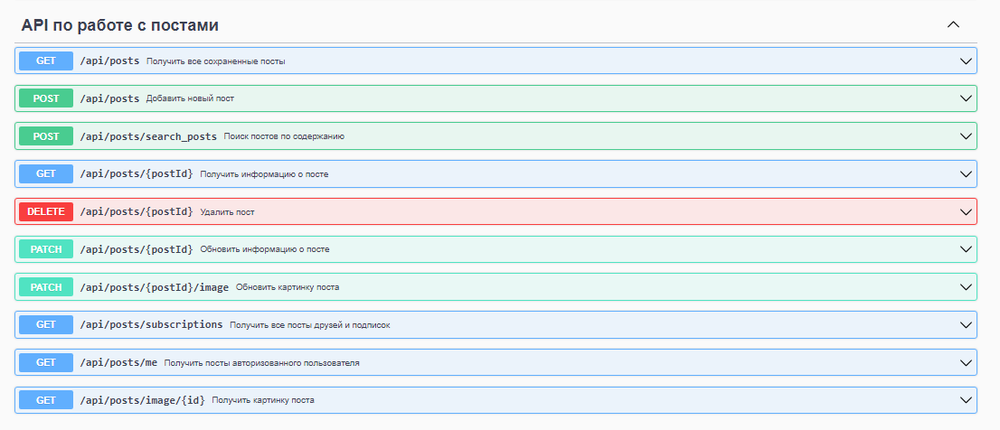

## SocialMediaWeb

*RESTful API для социальной медиа платформы, позволяющая пользователям регистрироваться, входить в систему, создавать
посты, переписываться, подписываться друг на друга и получать свою ленту активности*

## Бэкенд-часть проекта предполагает реализацию следующего функционала: ##

1. Аутентификация и авторизация:
   

- Пользователи могут зарегистрироваться, указав имя и фамилию пользователя, электронную почту и пароль.

`RegisterRequest`
```json
{
    "first_name": "user",
    "last_name":  "userovic",
    "email":	  "user@mail.ru",
    "password":	  "password"
}
```

- Пользователи могут войти в систему, предоставив правильные учетные данные (логин (почта) и пароль).

`LoginRequest`
```json
{
    "username": "user@mail.ru",
    "password":	"password"
}
```

- API обеспечивает защиту конфиденциальности пользовательских данных, включая хэширование паролей и использование JWT.

2. Управление постами:
   

- Пользователи могут создавать новые посты, указывая текст, заголовок и прикрепляя изображения.

`CreatePost`
```json
{
    "title":    "Заголовок поста",
    "content":	"Содержание поста"
}
```

- Пользователи могут просматривать посты других пользователей.

`ResponseWrapperPosts`

```json
{
    "count":  1,
    "results":	
    [
        PostDto
        {
            "id":	        1,
            "title":	        "Заголовок поста",
            "content":	        "Содержание поста",
            "image":	        "путь к картинке",
            "date_time_post":	"2023-09-15T12:01:36",
            "author_post":	1
        }
    ]
}
```

- Пользователи могут обновлять и удалять свои собственные посты.

`UpdatePost`

```json
{
  "title":      "Заголовок поста",
  "content":	"Содержание поста"
}
```

3. Взаимодействие пользователей:
   

- Пользователи могут отправлять заявки в друзья другим пользователям. С этого момента, пользователь, отправивший заявку,
  остается подписчиком до тех пор, пока сам не откажется от подписки. Если пользователь, получивший заявку, принимает
  ее, оба пользователя становятся друзьями. Если отклонит, то пользователь, отправивший заявку, как и указано ранее, все
  равно остается подписчиком.
- Пользователи, являющиеся друзьями, также являются подписчиками друг на друга.
- Если один из друзей удаляет другого из друзей, то он также отписывается. Второй пользователь при этом должен остаться
  подписчиком.
- Пользователи могут писать друг другу сообщения
  

4. Подписки и лента активности:

- Лента активности пользователя отображает последние посты от пользователей, на которых он подписан.
- Лента активности поддерживает пагинацию и сортировку по времени создания постов.

5. Обработка ошибок:

- API обрабатывает и возвращать понятные сообщения об ошибках при неправильном запросе или внутренних проблемах
  сервера.
- API осуществляет валидацию введенных данных и возвращает информативные сообщения при неправильном формате

6. Документация API:

- API задокументировано с использованием инструментов, таких как Swagger или OpenAPI.

---

## Спецификация OpenAPI для описания API ##

[OpenAPI specification](openapi.yaml "OpenAPI")

## Использован следующий стек технологий: ##

Java17\
SpringBoot 3\
Security\
JWT tokens\
Hibernate\
PostgreSQL\
Lombok\
Gradle\
Flyway\
Docker\
Mapstruct\
OpenAPI

## Структура базы данных: ##


##

[](https://git.io/typing-svg)